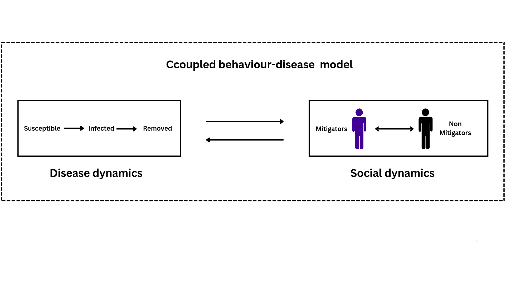

# Pandemic-waves-as-the-outcome-of-coupled-social-and-disease-dynamics

Mathematical epidemiology has become an important research field as interdisciplinary between medicine, biology and mathematics. Societies have seen the importances of this field making significant discoveries relevant to daily living. Infectious diseases is one area that has seen large amount of research contributions in the last few decades. Mathematics have been applied to model the dynamics of these diseases primarily following a conventional approach. This approach has played crucial roles to determine the end stage of the diseases and analyse key parameters. In recent times, it has become evident that the dynamics of the diseases is not only influenced by the pathogen causing the disease but the behaviour of the host population who are affected. As such conventional disease models which does not consider population exogenously has began to reconsider such. It is on this basis we undertake this study to evaluate the performance of a conventional disease model and a coupled behaviour-disease model with respect to prediction. 

## Model Architecture 
We model the SARS-CoV-2 virus transmission using Susceptible-Infected-Removed (SIR) model for the disease model, and the SIR coupled to a behaviour model (based on evoluntionary game theory) for the coupled behaviour-disease model. 

Refer to the paper for model details and results. 

This git repository contains the source code for particle estimates for disease model, and coupled behaviour-disease model presented in the paper. It also contains the data, estimated particles, figures, and others. 

